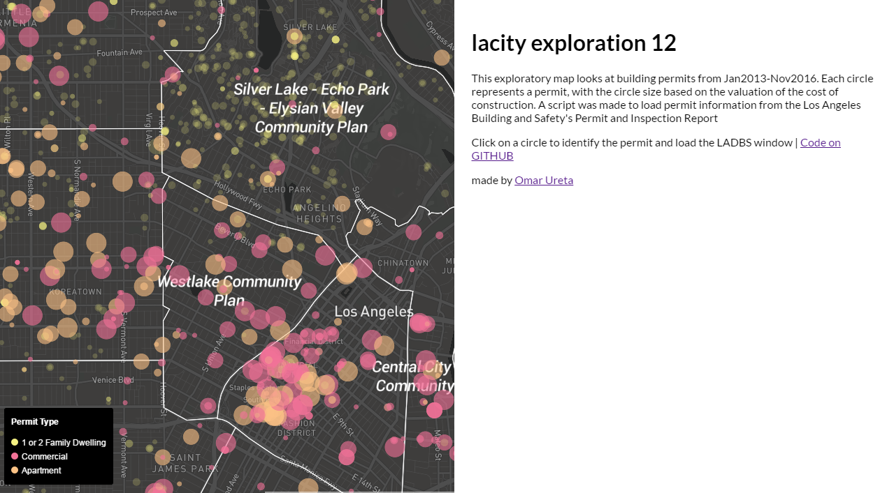
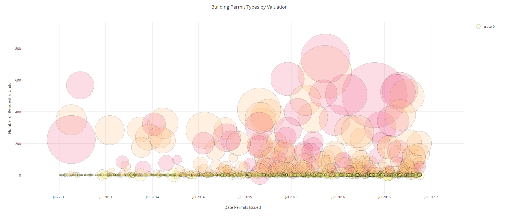

# LA City Exploration 12

Mapping Issued Building Permits from 2013-16 and directly loading LADBS permit report information.

### [LIVE MAP](https://cityhubla.github.io/lacity_exploration_12/#12.38/34.0644/-118.2724)

## Background
Land Use Development and Planning in the City of Los Angeles. The communication of permits issued from the Los Angeles Building and Safety
Department is not publically posted
The Los Angeles Building and Safety Department (LADBS) is tasked with permiting projects for contstruction. From allowing a fence to allowing the foundation
footings of a 5 story building to be poured. 

## Exploration
An exploration of the permit data from Jan2013 to Nov2016 identifying permits that involve `New Construction` or `Building Addition`.

## Existing Conditions
Typically the website is used by customers for
* Applying for permits
* Researching publications
* Requesting an inspection
* General information about the department and permit process.

## Mapping data
* An interactive map was made using open source tools like mapbox and QGIS.
* Map was color coded by type of use, `Commercial`, `Residential`
* The size of the circles are based on the valuation of the construction. The larger the valuation, the larger the circle.
* Webpage for map was split into two panes for map on left and a iframe to load the LADBS Permit and Inspection Report
* The `Permit Number` attribute is pulled when a user clicks on a marker for JQuery to load ladbs report on that case number.

## Visualizing with [plotly.js](https://plot.ly/javascript/) | open source JavaScript graphing library like D3
* An interactive graph was made to test the capabilities of the plotly.js graphing library

## [Live graph](https://cityhubla.github.io/lacity_exploration_12/timeline_3.html)

## Data Inquiries and Comments from Exploration
Pending
